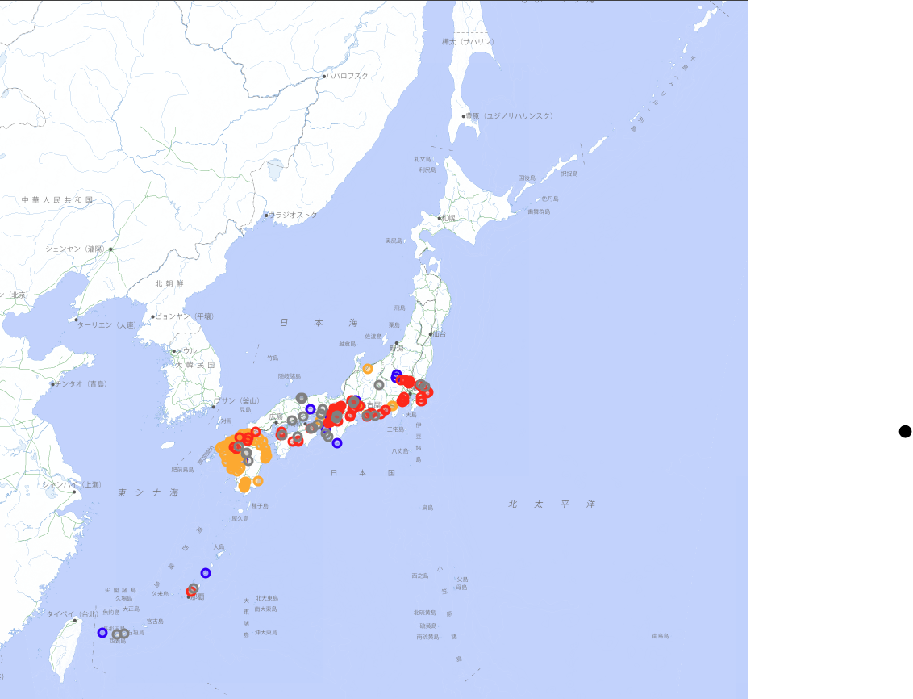

# Distribution of the invasive apple snail *Pomacea canaliculata* in Japan

Occurrence records of the channeled apple snail (*Pomacea canaliculata*) in Japan were downloaded from GBIF, explored, cleaned, and mapped with Python.
This is the first step toward a species distribution model of this invasive rice pest.



> Interactive map: [`outputs/pomacea_jp_clean_map.html`](outputs/pomacea_jp_clean_map.html) (download and open in a browser)

## Key findings

- **Distribution**: Records extend from Kyushu to the Pacific side of Kanto, with some records in Okinawa and the Yaeyama Islands. There are no records in Tohoku or Hokkaido, which is consistent with the species' low tolerance to cold winters.
- **Temporal bias**: Records start in 1982, but three quarters of them are from 2016 or later. The recent increase most likely reflects the growth of citizen science (e.g. iNaturalist) rather than an actual expansion.
- **Spatial bias from a single survey**: Of the 99 records from 2011–2018, 70 come from one survey dataset of molluscs in river estuaries in Kyushu ([Itsukushima et al. 2018](https://bdj.pensoft.net/article/26101/)). The high density of records in Kyushu therefore reflects sampling effort, not a higher population density.
- **Location quality**: Records with a coordinate uncertainty of about 28 km correspond to observations whose locations were obscured on iNaturalist, so their coordinates do not show the true location.

## Data cleaning

| Step | Criterion | Records |
| --- | --- | --- |
| Raw data | GBIF occurrences in Japan with coordinates | 293 |
| Taxon filter | Keep names starting with `Pomacea canaliculata` (3 DNA barcode BIN records removed) | 290 |
| Location uncertainty | Remove records with uncertainty > 1 km (records without a value are kept) | 275 |
| Duplicates | Remove records with the same coordinates and date | 260 |

The criteria assume an analysis at a 1 km grid resolution.

## Repository structure

```
├── notebooks/
│   ├── 01_download_and_clean.ipynb   # Download, exploration and cleaning
│   └── 02_map.ipynb                  # Interactive map by period
├── data/
│   └── pomacea_jp_clean.csv          # Cleaned records (260)
└── outputs/
    └── pomacea_jp_clean_map.html     # Interactive map
```

## How to run

The notebooks were written for Google Colab.

1. Open `notebooks/01_download_and_clean.ipynb` and run all cells. It downloads the records from GBIF and saves the cleaned data.
2. Open `notebooks/02_map.ipynb` and run all cells. It creates the interactive map.

The notebooks save files to Google Drive. Change the paths at the top of each notebook to match your own environment.

Main libraries: `pygbif`, `pandas`, `matplotlib`, `folium`

## Future work

- Aggregate records to 1 km and 10 km grids and compare the results
- Build a species distribution model with climate data (e.g. minimum temperature of the coldest month) and correct for sampling bias (spatial thinning, target-group background)
- Project the potential northward expansion under climate warming
- Analyse dispersal along water networks for a selected catchment (e.g. landscape connectivity with Circuitscape)

## Data source and citation

Occurrence data: GBIF.org, accessed via the GBIF occurrence search API on 2026-09-24.
Each record keeps the license given by its original publisher (e.g. CC0, CC BY, CC BY-NC).

Background map: [地理院タイル (GSI Tiles), Geospatial Information Authority of Japan](https://maps.gsi.go.jp/development/ichiran.html)

## License

The code in this repository is released under the [MIT License](LICENSE).
The data in `data/` follows the licenses of the original GBIF records.
